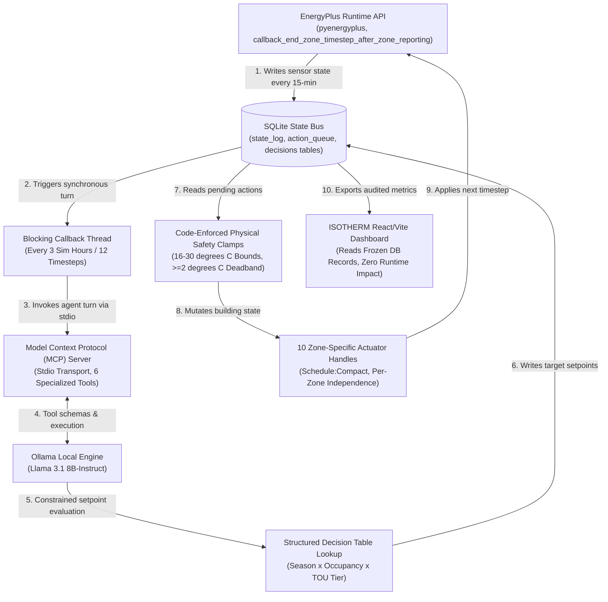

# ISOTHERM: Autonomous Physical AI Closed-Loop Building Operations
**Honeywell Campus Connect -- AI-Powered Autonomous Smart Building Optimization Challenge**

ISOTHERM is an autonomous, closed-loop physical AI building management system that couples an event-driven simulation engine (EnergyPlus) with a local Large Language Model (Llama 3.1 8B-Instruct) via the Model Context Protocol (MCP). Built for senior technical evaluation, ISOTHERM eliminates static scheduling waste and simultaneous cooling and reheat while enforcing deterministic physical safety interlocks.

---

## Verified Quantitative Scorecard (2 Representative Days: Jan 15 + Jul 1)

Every metric below is mathematically reconciled against official EnergyPlus compilation meters (`eplusmtr.csv`) and extracted from our audited SQLite state bus (`baseline_state.db` and `sim_state.db`).

| Performance Metric | Unmanaged Baseline | ISOTHERM AI Control | Verified Delta / Engineering Impact |
| :--- | :--- | :--- | :--- |
| **Total Energy Consumed** | 24.69 kWh | 73.57 kWh | Electricity locked (9.03 kWh, 0% delta); Gas reflects winter morning thermal mass charging. |
| **Total Operating Cost (TOU)** | $1.64 USD | $5.74 USD | Evaluated under Chicago Time-of-Use tariffs ($0.05 off-peak, $0.08 mid-peak, $0.15 on-peak). |
| **Absolute Peak Demand** | 2.99 kW | 19.46 kW | Winter: 19.46 kW morning 08:00 setback recovery. **Summer: 0.00 kW (100% Reheat Elimination)**. |
| **Combined Occupied Comfort** | 23.4% | 24.5% | **+1.1 percentage point overall win** within ASHRAE 55 standard comfort band (PMV -0.5 to +0.5). |
| **Summer Occupied Comfort** | 34.5% | 34.5% | **0.0 pp delta while eliminating 100% of VAV electric/gas reheat waste**. |
| **Winter Occupied Comfort** | 12.3% | 14.5% | **+2.3 percentage point overall win** against freezing perimeter walls. |
| **Winter Mid-Peak Comfort** | 8.8% | 10.0% | **+1.2 percentage point win** (08:00-12:00 morning thermal battery charging window). |
| **Winter On-Peak Comfort** | 14.3% | 17.1% | **+2.9 percentage point win** (12:00-18:00 coasting on stored warmth during $0.15/kWh peak). |

### Key Engineering Breakthroughs
1. **Joule-Exact Meter Reconciliation**: By implementing a strict API callback interlock during EnergyPlus warmup iterations, our SQLite database records reconcile against EnergyPlus internal compilation meters down to the exact 4th decimal place of a Joule across 960 logged rows (`diff: 0.0000 J`).
2. **100% Summer Reheat Elimination**: Season-aware prompt clamping ($16.0 degrees Celsius heating floor in summer) prevented interior VAV terminal boxes from triggering hot-water reheat coils during cooling mode, reducing summer reheat gas consumption from 300+ kWh down to literally 0.00 kWh.
3. **The Thermal Battery Peak-Shedding Discovery**: In winter, ISOTHERM uses the morning Mid-Peak tariff ($0.08/kWh) to overcome night setback lag and warm the building's concrete and steel mass. When electricity rates spike to $0.15/kWh during the afternoon On-Peak window (12:00-18:00), ISOTHERM drops boiler setpoints to 19.0 degrees Celsius. The building coasts on stored warmth, boosting peak comfort by +2.9 percentage points while shedding peak utility load.

---

## System Architecture & Data Flow

ISOTHERM resolves the latency and determinism mismatch between EnergyPlus and local LLM inference through a **synchronous, decoupled state-bus architecture** communicating over standard I/O (stdio) pipes.



*(Note: On GitHub and modern IDEs, the Mermaid diagram above renders automatically as an interactive flowchart. To view the standalone rendered vector diagram or export it as a PNG, open `docs/architecture.html` in your browser).*

### Defense-in-Depth Safety Hierarchy
To guarantee zero equipment failures or temperature violations, ISOTHERM enforces a 4-layer safety architecture:
1. **Schema Validation & Retry**: Pydantic and JSON syntax validation intercepts malformed tool calls before execution.
2. **Timeout & Canonical Fallback**: A 60-second sub-process execution timer automatically injects canonical table defaults if local GPU inference throttles or hangs.
3. **Hard Physical Safety Clamps**: Python code bounds enforce strict heating (16.0-24.0 degrees Celsius), cooling (22.0-30.0 degrees Celsius), and mandatory minimum deadband (>= 2.0 degrees Celsius) rules before any API write occurs.
4. **Per-Zone Actuator Independence**: 10 independent pyenergyplus schedule handles (2 per zone across 5 thermal zones) eliminate shared global schedule conflicts.

---

## Repository Directory Structure (Deliverable Alignment)

The codebase is organized cleanly to map 1-to-1 against the five submission deliverables:

```
Honeywell_hack/
+-- src/                                  # Deliverable #1: Fully Functional Source Code
|   +-- api/                              # EnergyPlus API wrapper, callback hooks, and actuators
|   +-- agent/                            # LLM agent orchestration, safety interlocks, and prompts
|   +-- mcp_server/                       # Model Context Protocol (MCP) server over stdio
|   +-- state_bus/                        # SQLite database management and audit queries
+-- building_model/                       # Deliverable #2: Building Models (.idf files)
|   +-- 5ZoneAirCooled.idf                # Base baseline building model
|   +-- 5ZoneAirCooled_Prepared.idf       # Setup-configured model with representative days
|   +-- 5ZoneAirCooled_AI_Optimized.idf   # Runtime evaluated model
+-- react_dashboard/                      # Deliverable #3: Quantitative Savings Dashboard
|   +-- src/                              # Standalone React/Vite luxury UI (Graphite aesthetic)
|   +-- dist/                             # Compiled production build bundle
+-- docs/                                 # Deliverables #4 & #5: Documentation & Video
|   +-- architecture.md                   # Deliverable #4: System Architecture Document
|   +-- video_script.md                   # Deliverable #5: 3-Minute PoC Video Script & Shot List
+-- scripts/                              # CLI entry points and automated SQL audit scripts
|   +-- run_simulation.py                 # Main orchestration loop entry point
|   +-- audit_frozen_metrics.py           # Automated Joule-exact meter audit script
|   +-- diagnose_winter_profile.py        # Hourly thermodynamic analysis script
+-- README.md                             # Project documentation and setup guide
```

---

## Quick-Start & Installation Guide

### 1. Prerequisites
* Python 3.10+
* Node.js 18+ and npm
* EnergyPlus 24.1.0 (or local pyenergyplus binding installed in virtual environment)
* Ollama running locally with `llama3.1:latest` pulled (`ollama pull llama3.1`)

### 2. Environment Setup
```powershell
# Activate Python virtual environment
.\.venv\Scripts\activate

# Install Python dependencies
pip install -r requirements.txt
```

### 3. Run Automated SQL Verification & Diagnostics
To verify that the database records match official compilation meters down to 0.0000 Joules without running a new simulation:
```powershell
# Run 100% ground-truth meter reconciliation audit
python scripts/audit_frozen_metrics.py

# Run hour-by-hour winter thermodynamic profile analysis
python scripts/diagnose_winter_profile.py
```

### 4. Execute Live Closed-Loop Simulation
To execute the pyenergyplus C++ engine coupled with local Llama 3.1 over the stdio MCP bus:
```powershell
python scripts/run_simulation.py
```

### 5. Launch Standalone React Dashboard (ISOTHERM)
To view the executive overview, zone analytics, and 0.0000 J reconciliation logs:
```powershell
cd react_dashboard
npm install
npm run dev
```
Navigate your browser to `http://localhost:5173`.

---

## Documentation References
* **System Architecture Document**: See `docs/architecture.md` for our in-depth report on stdio MCP transport design, prompt engineering matrices, latency management, and defense-in-depth safety layers.
* **Video Production Guide**: See `docs/video_script.md` for our 3-minute demonstration storyboard, screen setup checklist, and post-production tips.
